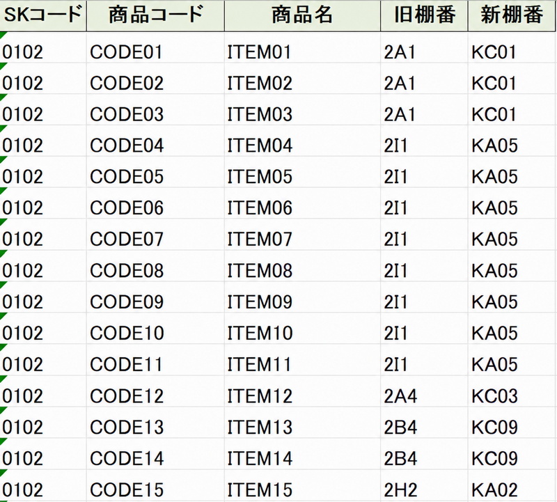

# AIを活用した倉庫移転時の棚番変換とマスタ更新の効率化

## 主な成果

### 移転当日に棚番マスタの全件更新を完了

3年前の倉庫移転では、移転後、すべての棚番マスタの変更を完了するまでに約2か月を要しました。

今回は、AIを活用したVBAツールで約19,000件の棚番データの更新準備を行い、システム部門による一括更新プログラムの導入と組み合わせることで、移転当日にすべての棚番マスタの変更を完了しました。

これにより、移転直後から新棚番を使った出荷業務を行える状態を整えました。

### 更新に必要なデータの作成時間を短縮

- 新旧棚番変換表の作成時間：約2時間 → 約5分
- 更新用Excelファイルの作成時間：約2～3時間 → 約5分

これらは個別のデータ作成作業にかかる時間です。前述の「約2か月」と「移転当日」は、棚番マスタ全件の変更が完了するまでの期間・時点を示しています。

---

## 概要

倉庫移転に伴い、既存の棚番体系を全面的に見直し、新しい棚番へ移行する必要がありました。

基幹システム上の棚番マスタの変更には、システム部門が用意した一括更新プログラムを使用しました。本プロジェクトでは、そのプログラムに読み込ませる、品目コードと新棚番を対応させた更新用Excelファイルの作成を担当しました。

AIを活用して、次の2つのVBAツールを作成しました。

- 新旧棚番変換表作成ツール
- 更新用Excelファイル作成ツール

これにより、移転計画の変更に応じて必要なデータを再作成できる環境を整え、次の業務課題に対応しました。

- 移転作業時の商品移動先の明確化
- システム上の棚番情報更新に必要なデータ作成
- 移転直後からの新棚番による出荷業務の実施

### 棚番変更のイメージ

新倉庫の同じレイアウトを、旧棚番と新棚番でそれぞれ表記します。この2つの配置図の同じ位置を照合し、棚番の対応関係を取り出します。

※掲載画像は、動作説明のために作成した公開用サンプルです。実際の業務データではありません。画像をクリックすると拡大して確認できます。

**旧棚番配置図：新倉庫での商品配置を、旧棚番で表記**

**新棚番配置図：同じレイアウトを、新棚番で表記**

---

## 本プロジェクトで作成したもの

### 1. 新旧棚番変換表作成ツール

旧棚番で表記した配置図と、同じレイアウトを新棚番で表記した配置図をExcelで用意し、両方の配置図を基に、新旧棚番変換表を自動生成するツールです。

VBAは、同じブック内の「旧棚番配置図」と「新棚番配置図」の同一セル位置を読み取り、旧棚番と新棚番の対応を一覧にします。

**出力例：旧棚番と新棚番の対応表**

当初はAIへ直接変換表の作成を依頼する予定でしたが、移転計画の検討が進む中で、商品の配置場所や棚番の割り当てが何度も変更されました。

そこで、配置図を修正すれば、その時点の新旧棚番変換表を何度でも生成できる仕組みを作りました。

作成した変換表は、次の用途に使用しました。

- 移転作業時の商品移動先の確認
- 作業者への移動先の指示
- 既存の棚番マスタに新棚番を付与するための対応データ

### 2. 更新用Excelファイル作成ツール

既存の棚番マスタと新旧棚番変換表を基に、各品目に新棚番を付与するツールです。

VBAは、棚番マスタの旧棚番を変換表と照合し、同じブックのデータシートに新棚番の列を追加します。この処理結果を、品目コードと新棚番が対応した更新用Excelファイルとしてシステム部門へ提供しました。

**出力例：品目コードと新棚番を対応させた更新用データ**

確認用に旧棚番も表示しています。画像では、品目コードを「商品コード」と表記しています。

変換表が修正された場合でも、最新の対応関係で更新用データを再生成できるようになりました。

※公開しているVBAの処理範囲は、データシートへの新棚番の出力までです。別ファイルへの保存処理は含んでいません。

※基幹システムの棚番マスタを一括更新するプログラムは、システム部門が準備したものです。本プロジェクトでは、その更新に必要なデータ作成を担当しました。

---

## 業務の流れ

1. 新倉庫の同じレイアウトについて、旧棚番で表記した配置図と新棚番で表記した配置図を用意
2. 2つの配置図から、新旧棚番変換表を生成
3. 既存の棚番マスタと変換表を照合し、各品目に新棚番を付与
4. 品目コードと新棚番が対応した更新用Excelファイルをシステム部門へ提供
5. システム部門の一括更新プログラムで、基幹システムの棚番マスタを更新

新旧棚番変換表は「旧棚番と新棚番の対応」を示すものです。一方、更新用Excelファイルは「品目コードと新棚番の対応」を持ち、基幹システムの更新に使用するものです。

---

## 背景と課題

倉庫移転では、旧倉庫の商品を新倉庫へ運搬するだけでなく、各商品をどの棚へ配置するかを明確にする必要がありました。

また、移転後の出荷業務に向けて、現場の商品配置と基幹システムに登録された棚番を一致させる必要がありました。

3年前の倉庫移転では、移転後、すべての棚番マスタの変更を完了するまでに約2か月を要しました。今回は、移転直後から新棚番で業務を行えるよう、更新に必要なデータの準備と、システム上の一括更新を進めることが重要でした。

対象は約19,000件あり、手作業による更新準備には次の課題がありました。

- 作業負荷が大きい
- 転記や入力によるミスが発生しやすい
- レイアウト変更のたびに修正作業が必要になる
- 更新の完了が移転後の業務に影響する

さらに、移転作業時に商品と移動先の棚番の対応が明確でなければ、現場で配置先を判断できず、作業が停滞する恐れもありました。

---

## 検討した解決策

### 案1：システム部門による棚番一括更新

基幹システムの棚番マスタを一括更新する方法について、システム部門へ相談しました。

しかし、当初は実施が困難との回答であり、ほかの方法も検討する必要がありました。

### 案2：PythonによるRPA

次に、AIを活用してPythonによるRPAプログラムを作成し、棚番更新作業の自動化を試みました。

一定の成果は得られたものの、今回の処理では更なる速度の高速化が求められたので、万一の代替手段として開発・採用しました。

### 案3：VBAによる更新用データの作成と、システム部門による一括更新

棚番マスタを一括更新する必要性を整理し、改めてシステム部門へ相談しました。

その結果、費用は発生するものの、システム部門で一括更新プログラムを導入できることになりました。

一括更新に必要なのは、品目コードと新棚番が対応した更新用Excelファイルでした。

そこで、次の役割分担で対応しました。

- 本プロジェクト：配置図から新旧棚番変換表を生成し、各品目に新棚番を付与した更新用Excelファイルを準備
- システム部門：一括更新プログラムを準備し、基幹システムの棚番マスタを更新

この方法により、移転現場で使う対応表と、システム更新に必要なデータの両方を準備できるようになりました。

---

## 解決への取り組み

### 1. システム部門との調整

システム部門へ、棚番マスタの一括更新の必要性を説明し、実施方法を相談しました。

更新用Excelファイルを準備することで、システム部門が用意するプログラムを使って棚番マスタを一括更新できる環境が整いました。

### 2. 新旧棚番変換表作成ツールの作成

新倉庫のレイアウトをExcelで作成し、次の2つの配置図を準備しました。

- 旧棚番で表記した配置図
- 同じレイアウトを新棚番で表記した配置図

移転計画の検討中には、商品の配置場所や棚番の割り当てが何度も見直されました。

そのため、配置図の同じセル位置から旧棚番と新棚番を読み取り、変換表を生成するVBAをAIへ指示して作成しました。

これにより、レイアウト変更時にも最新の変換表を再生成できるようになりました。また、この変換表を移転作業時の商品移動先の確認にも活用しました。

### 3. AI活用時の課題と改善

初回の実行では、一部の棚番しか変換されませんでした。

原因を調査したところ、対象セル範囲や入力条件の説明が不足していることが分かりました。

そこで、AIへの指示では、次の条件を具体的に示すようにしました。

- シート名
- 処理対象範囲
- 空白セルの扱い
- 出力形式
- エラー時の対応

生成されたコードと出力結果を確認し、指示を修正することで、必要な変換表を作成できるようにしました。

### 4. 更新用Excelファイル作成ツールの作成

新旧棚番変換表を基に、既存の棚番マスタへ新棚番を付与するVBAをAIへ指示して作成しました。

このツールでは、変換表を辞書形式で読み込み、棚番マスタの旧棚番と照合して新棚番を出力します。

主な機能は次のとおりです。

- ヘッダー名による対象列の認識
- 配列とDictionaryを利用した一括処理
- 変換表に存在しない旧棚番の検出と強調表示
- ステータスバーへの進捗表示
- 変換件数や未定義件数の表示

変換表が修正された場合にも、最新の内容で更新用データを再生成できるようになりました。

### 5. システム反映

作成した更新用Excelファイルをシステム部門へ提供しました。

システム部門が準備した一括更新プログラムへデータを投入し、基幹システムの棚番マスタを更新しました。

その結果、移転当日にすべての棚番マスタの変更が完了し、移転直後から新棚番を使った出荷業務を行える状態になりました。

---

## 業務上の効果

### 移転作業の効率化

- 商品の移動先棚番を明確化
- 作業者への指示を統一
- 商品配置作業を支援

### 更新用データの準備を効率化

- 約19,000件の棚番データに対応する更新用Excelファイルを準備
- レイアウト変更時にも変換表と更新用データを再生成
- 人手による転記作業を削減

### 移転当日の棚番マスタ更新完了

- システム部門との連携により、移転当日に全件の変更を完了
- 現場の商品配置とシステム上の棚番を一致
- 移転直後から新棚番による出荷業務を実施

---

## AI活用で得られた学び

本プロジェクトを通じて、AIを業務改善に活用するためには、次の取り組みが必要だと学びました。

- 業務課題と必要なデータを整理すること
- 将来の変更を見越して、繰り返し使える仕組みを設計すること
- 入力条件や出力形式を具体的に指示すること
- 生成されたコードと出力結果を検証し、改善すること
- 関係部門と役割を分担し、実際の運用につなげること

AIによるコード生成を活用しながら、業務知識に基づく要件整理と検証を行い、システム部門との連携によって移転当日の棚番マスタ更新完了につなげました。
