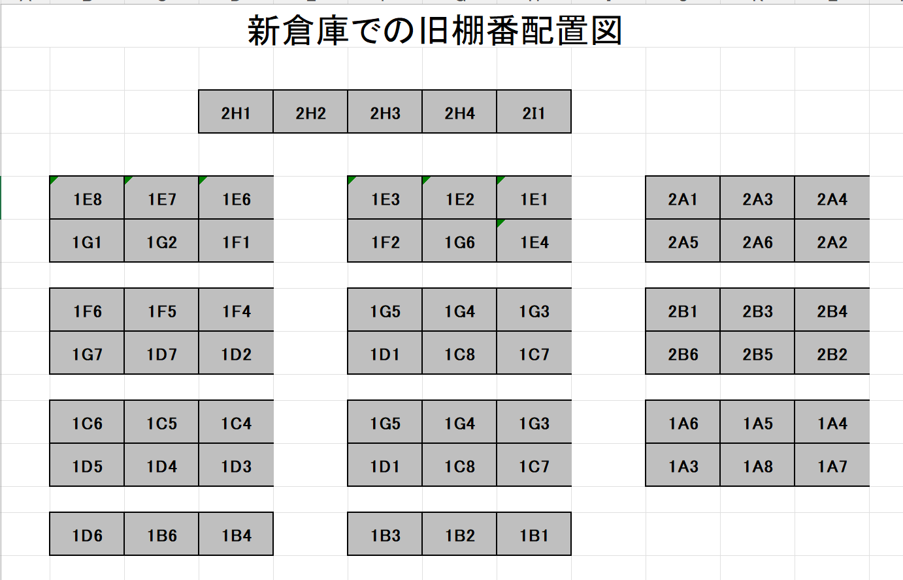
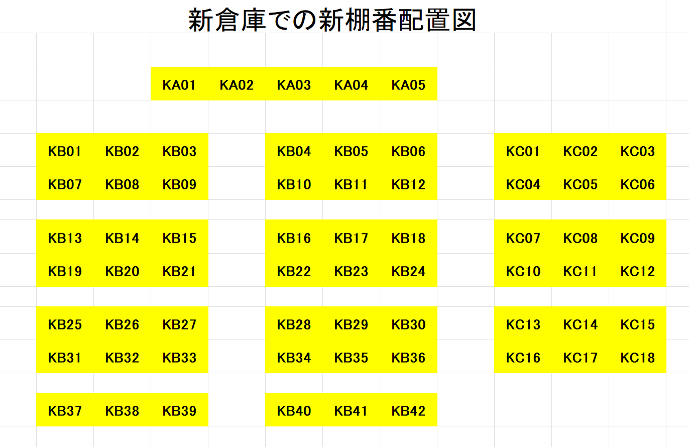
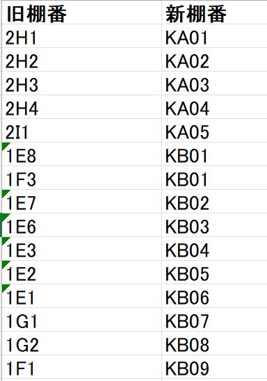
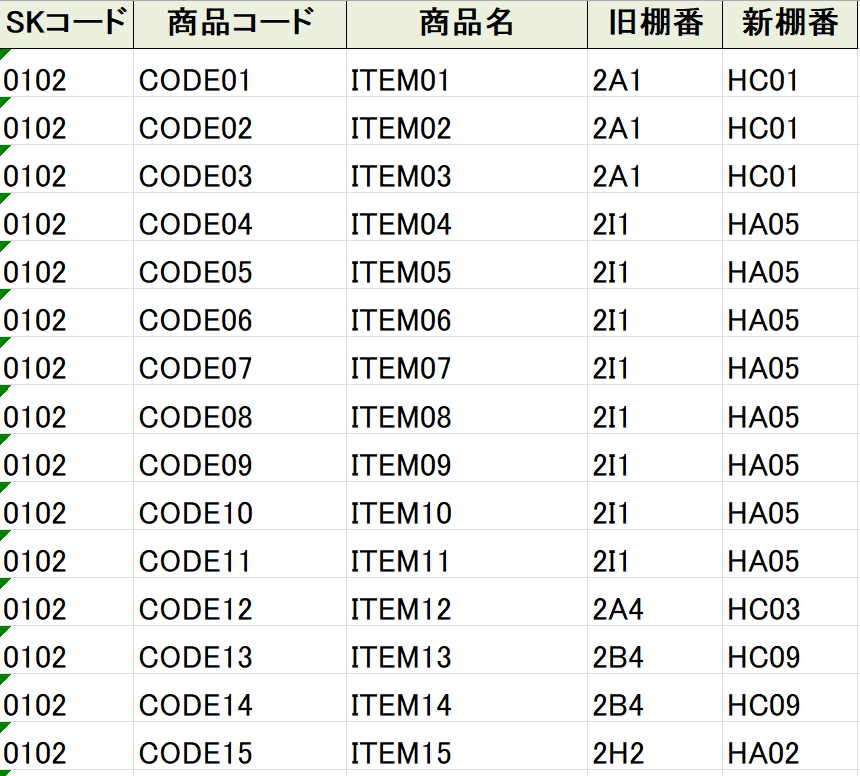

# AIを活用した倉庫移転時の棚番変換とマスタ更新の効率化

## 概要

倉庫移転に伴い、既存の棚番体系を全面的に見直し、新しい棚番へ移行する必要がありました。

本プロジェクトでは、AIを活用して

* 新旧棚番変換表作成ツール
* 更新用Excelファイル作成ツール

を作成し、移転作業から移転後の出荷業務までを円滑に実施できる環境を構築しました。

単なるツール作成ではなく、

* 移転作業時の商品移動先の明確化
* システム上の棚番情報更新に必要なデータ作成
* 移転後の出荷業務継続

という業務上の重要課題を解決した事例です。

---

## 本プロジェクトで作成したもの

### 1. 新旧棚番変換表作成ツール

旧棚番配置図と新棚番配置図を基に、新旧棚番変換表を自動生成するツールです。

当初はAIへ直接変換表作成を依頼する予定でしたが、移転計画の検討が進む中でレイアウト変更が頻繁に発生しました。

そのため、

「変換表を作成する」のではなく、

「変換表を必要な時に何度でも作成できるようにする」

という考え方へ切り替えました。

このツールにより、

* レイアウト変更時でも最新の変換表を再生成可能
* 商品の移動先棚番を明確化
* 移転作業時の指示を統一

できるようになりました。

### 2. 更新用Excelファイル作成ツール

既存の棚番マスタと新旧棚番変換表を基に、新棚番を付与した更新用Excelファイルを作成するツールです。

変換表が修正された場合でも、最新の更新用Excelファイルを短時間で再生成できるようになりました。

作成した更新用Excelファイルをシステム部門へ提供することで、棚番一括更新を実施できるようになりました。

※棚番一括更新プログラム自体はシステム部門が準備したものです。
本プロジェクトでは、その更新に必要なデータ作成を担当しました。

---

## サンプル画面

### 旧棚番配置図

### 新棚番配置図

### 新旧棚番変換表

### 更新用Excelファイル

---

## 背景

移転作業では、旧倉庫の商品を新倉庫へ運搬しますが、

「旧棚番の商品を、新倉庫のどの棚へ配置するのか」

を明確にする必要がありました。

---

## 課題

前回の倉庫移転では、新旧棚番対応表を手作業で作成しており、完成まで約2か月を要していました。

今回も同様の方法を採用した場合、

* 作業負荷が大きい
* 人的ミスが発生しやすい
* 移転スケジュールへ影響する

というリスクがありました。

また、移転作業時に新棚番が明確でなければ、商品を新倉庫のどこへ配置すれば良いのか判断できず、作業全体が停滞する恐れもありました。

---

## 検討した解決策

### 案1：システム部門による棚番一括更新

最も理想的な方法は、システム部門による棚番一括更新プログラムの導入でした。

しかし当初は実施が困難との回答であり、この方法だけに依存することはできませんでした。

### 案2：PythonによるRPA

次に、AIを活用してPythonによるRPAプログラムを作成し、棚番更新作業の自動化を試みました。

一定の成果は得られたものの、処理速度の面で課題があり、大量データの更新には適していませんでした。

### 案3：新旧棚番変換表作成ツールと更新用Excelファイル作成ツール

その後、倉庫移転における棚番マスタ一括更新の必要性を整理し、改めてシステム部門へ相談を行いました。

その結果、費用は発生するものの、システム部門にて棚番一括更新プログラムを導入していただけることとなりました。

システム部門が必要としていたのは、新しい棚番が設定された更新用Excelファイルです。

しかし、約19,000件の棚番データを手作業で更新することは現実的ではありませんでした。

そこで、既存の棚番マスタに登録されている旧棚番を新棚番へ置き換える方法を考えました。

そのためには、旧棚番と新棚番の対応関係を整理した新旧棚番変換表が必要になります。

そこで、

* 新旧棚番変換表を必要な時に再生成できるツール
* 更新用Excelファイルを再生成できるツール

を作成する方法を採用しました。

この方法により、

* 移転作業時の商品移動先を明確化できる
* 更新用Excelファイルを効率的に作成できる
* レイアウト変更にも柔軟に対応できる

というメリットがありました。

結果として、現場作業で利用する新旧棚番変換表と、システム更新に必要な更新用Excelファイルの両方を効率的に作成できるようになりました。

---

## 解決への取り組み

### 1. システム部門への相談

前述のとおり、当初はシステム部門へ棚番一括更新プログラムの導入を依頼しましたが、実施が困難との回答でした。

その後、棚番マスタ一括更新の必要性を改めて説明した結果、システム部門にて棚番一括更新プログラムを導入していただけることとなりました。

これにより、更新用Excelファイルを準備することで、システム上の棚番を一括更新できる環境が整いました。

### 2. 新旧棚番変換表作成ツールの作成

新倉庫のレイアウトをExcelで作成し、

* 旧棚番配置図
* 新棚番配置図

を準備しました。

当初はAIへ直接変換表作成を依頼する予定でした。

しかし、商品の配置場所が何度も見直され、その都度棚番の割り当てが変更されました。

そこで、配置図から新旧棚番変換表を生成するVBAをAIへ指示して作成しました。

これにより、レイアウト変更時でも最新の変換表を短時間で再作成できるようになりました。

また、この変換表は移転作業時の商品移動先を明確にする役割も果たしました。

### 3. AI活用時の課題と改善

初回の実行では、一部の棚番しか変換されませんでした。

原因を調査したところ、

* 対象セル範囲が曖昧だった
* 入力条件の説明が不足していた

ことが分かりました。

そこで、

* シート名
* 処理対象範囲
* 空白セルの扱い
* 出力形式
* エラー時の対応

を明示的に指示するよう改善しました。

その結果、正確な新旧棚番変換表を作成できるようになりました。

### 4. 更新用Excelファイル作成ツールの作成

新旧棚番変換表完成後、AIへ指示し、棚番マスタへ新棚番を付与するVBAプログラムを作成しました。

このプログラムは、

* 棚番マスタ
* 新旧棚番変換表

を読み込み、更新用Excelファイルを作成します。

変換表の修正が発生した場合でも、短時間で最新の更新用Excelファイルを再生成できるようになりました。

### 5. システム反映

作成した更新用Excelファイルをシステム部門へ提供しました。

システム部門が準備した棚番一括更新プログラムへデータを投入し、システム上の棚番情報を新棚番へ更新しました。

これにより、移転後も新棚番を利用した出荷業務が可能となりました。

---

## 成果

### 移転作業の効率化

* 商品の移動先棚番を明確化
* 作業者への指示を統一
* 商品配置作業を効率化

### データ整備の効率化

* 約19,000件の棚番データ更新に必要な更新用Excelファイルを作成
* 更新用Excelファイルを短時間で再生成可能
* 人手による転記作業を大幅削減

### 移転後の業務継続

* システム上の棚番情報を更新
* 現場とシステムの棚番を一致
* 新棚番による出荷業務を開始

---

## AI活用で得られた学び

本プロジェクトで重要だったのは、AIにコードを書かせることではありませんでした。

重要だったのは、

* 業務課題を整理すること
* 将来の変更を見越して運用方法を設計すること
* AIへ適切な指示を行うこと
* 出力結果を検証し改善すること

でした。

AIは強力な支援ツールですが、実務で成果を出すためには業務知識と検証プロセスが不可欠です。

本プロジェクトでは、AIを単なるコード生成ツールとしてではなく、業務改善を実現するための支援ツールとして活用しました。

## サンプル画面

### 旧棚番配置図

### 新棚番配置図

### 新旧棚番変換表

### 更新用Excelファイル

